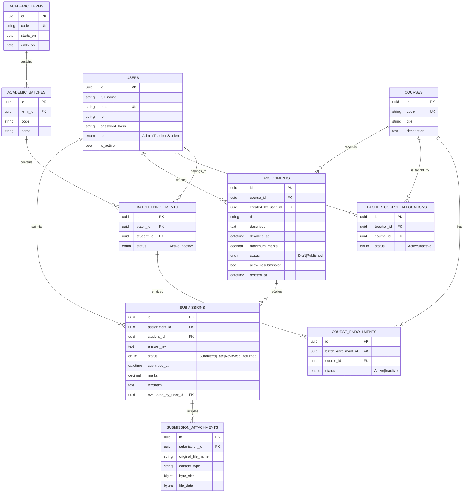

# PostgreSQL Backend Database Design

## Summary

Build the backend with ASP.NET Core 10, EF Core, and PostgreSQL. Use `Courses` for the subjects students take and `AcademicBatches` for their academic grouping. An administrator first enrols each student in a batch, then selects that batch's members and enrols them directly in a course. Published assignments target the course, so every active enrollee sees them regardless of their batch or which allocated teacher created them. Store submitted-file bytes and metadata in PostgreSQL.

## Key Backend Rules

- A user has one role; `full_name` supports teacher and student display throughout the UI. `roll` is an optional string attribute for a student's academic roll number; it has no uniqueness or authorization behavior. Authenticate with a JWT bearer token and enforce role-based authorization from the token's role claim.
- Issue short-lived, signed JWTs containing the user ID, email, role, and authentication-version claims. The frontend sends each token as `Authorization: Bearer <token>`; do not store authentication state in cookies, so antiforgery protection is not required for this bearer-token API.
- A student has at most one active batch enrolment per academic term. `BATCH_ENROLLMENTS` is unique by `(student_id, batch_id)`.
- An administrator manages course enrolment. They select active members of a batch and create `COURSE_ENROLLMENTS` for the chosen course. `COURSE_ENROLLMENTS` is unique by `(batch_enrollment_id, course_id)`.
- Teachers are allocated to courses. The backend permits assignment creation or marking only to an active allocation, but an assignment directly references its `course_id` as its audience.
- Students view all non-deleted published assignments for their active course enrolments, regardless of the batch from which they were selected or the assignment author. They may submit only their own answer, before the deadline and under the resubmission policy.
- Assignment deletion is a soft delete: set `deleted_at`; never cascade-delete submissions or their attachments. Exclude deleted assignments from normal queries.
- Store only the current submission version. Store attachment metadata and binary content in PostgreSQL (`bytea`); validate file type and a configured maximum file size before persisting the upload.
- Validate marks from `0` through `maximum_marks`, publish state, deadlines, active enrolments, and role authorization in the ASP.NET Core service layer.

## Public Types

- `UserRole`: `Admin`, `Teacher`, `Student`
- `EnrollmentStatus`: `Active`, `Inactive`
- `TeacherCourseAllocationStatus`: `Active`, `Inactive`
- `AssignmentStatus`: `Draft`, `Published`
- `SubmissionStatus`: `Submitted`, `Late`, `Reviewed`, `Returned`

## ASP.NET Core Architecture

- Target ASP.NET Core 10 with the Npgsql EF Core provider. Keep the PostgreSQL connection string in environment-specific configuration and create the schema through EF Core migrations and seed data.
- Use `Models` for entities, DTOs, enums, and validation models. Keep persistence entities separate from request and response DTOs.
- Place `AppDbContext` and EF Core entity configurations in a dedicated `DbContext` folder.
- Organize `Controllers` and `Services` by feature—such as `Auth`, `Users`, `Batches`, `Courses`, `Assignments`, and `Submissions`. Each feature folder contains its interface and implementation, with controllers delegating business rules to services.
- Put `IUnitOfWork` and `UnitOfWork` in a dedicated `UnitOfWork` folder. Services use it to coordinate database operations and call `SaveChangesAsync` once per successful write workflow.
- Configure dependencies through ASP.NET Core DI: DbContext as scoped, Unit of Work as scoped, and feature services/controllers through their declared interfaces.

## Feature Services and Controllers

Implement 10 feature services with matching controllers. `AppDbContext` and `IUnitOfWork`/`UnitOfWork` are shared infrastructure, not feature services. Controllers validate HTTP input, apply endpoint authorization, and translate results to HTTP responses; services enforce resource-level authorization and business rules; only services use the Unit of Work.

| Feature | Service and methods | Controller and actions | Purpose |
|---|---|---|---|
| Authentication | `IAuthService`: `AuthenticateAsync`, `GetCurrentUserAsync` (2) | `AuthController`: `Login`, `Logout`, `Me` (3) | Validates credentials and active status, returns the authenticated user, and issues a signed JWT from the controller. Logout is client-side token disposal; it has no database service method because access tokens are stateless. |
| Users | `IUserService`: `GetUsersAsync`, `GetUserByIdAsync`, `CreateUserAsync`, `UpdateUserAsync`, `SetUserActiveStatusAsync`, `ChangePasswordAsync` (6) | `UsersController`: `GetAll`, `GetById`, `Create`, `Update`, `SetActiveStatus`, `ChangePassword` (6) | Admin account management, including creating students and teachers, updating profile details, disabling access, and resetting credentials. |
| Academic terms | `IAcademicTermService`: `GetAcademicTermsAsync`, `GetAcademicTermByIdAsync`, `CreateAcademicTermAsync`, `UpdateAcademicTermAsync`, `DeleteAcademicTermAsync` (5) | `AcademicTermsController`: `GetAll`, `GetById`, `Create`, `Update`, `Delete` (5) | Admin management of academic periods. Deletion is rejected when batches reference the term. |
| Batches | `IBatchService`: `GetBatchesAsync`, `GetBatchByIdAsync`, `CreateBatchAsync`, `UpdateBatchAsync`, `DeleteBatchAsync`, `GetBatchStudentsAsync`, `AssignStudentAsync`, `SetBatchEnrollmentStatusAsync` (8) | `BatchesController`: `GetAll`, `GetById`, `Create`, `Update`, `Delete`, `GetStudents`, `AssignStudent`, `SetStudentEnrollmentStatus` (8) | Admin creates batches, inspects members, adds a student to a batch, and activates/deactivates their batch membership. |
| Courses | `ICourseService`: `GetCoursesAsync`, `GetCourseByIdAsync`, `CreateCourseAsync`, `UpdateCourseAsync`, `DeleteCourseAsync` (5) | `CoursesController`: `GetAll`, `GetById`, `Create`, `Update`, `Delete` (5) | Admin maintains the reusable course catalog. Deletion is rejected when allocations, enrolments, or assignments exist. |
| Course enrolments | `ICourseEnrollmentService`: `GetCourseStudentsAsync`, `GetStudentCoursesAsync`, `EnrollStudentsAsync`, `SetCourseEnrollmentStatusAsync` (4) | `CourseEnrollmentsController`: `GetCourseStudents`, `GetStudentCourses`, `EnrollStudents`, `SetStatus` (4) | Admin selects active members of a batch and assigns them directly to a course. `EnrollStudentsAsync` accepts a course ID plus selected batch-enrolment IDs and verifies they are active before creating enrolments. |
| Teacher-course allocations | `ITeacherCourseAllocationService`: `GetCourseTeachersAsync`, `GetTeacherCoursesAsync`, `AllocateTeacherAsync`, `SetTeacherCourseAllocationStatusAsync` (4) | `TeacherCourseAllocationsController`: `GetCourseTeachers`, `GetTeacherCourses`, `AllocateTeacher`, `SetStatus` (4) | Admin grants or removes a teacher's authority to create assignments, read submissions, and grade work for a course. |
| Assignments | `IAssignmentService`: `GetAssignmentsAsync`, `GetAssignmentByIdAsync`, `CreateAssignmentAsync`, `UpdateAssignmentAsync`, `PublishAssignmentAsync`, `DeleteAssignmentAsync` (6) | `AssignmentsController`: `GetAll`, `GetById`, `Create`, `Update`, `Publish`, `Delete` (6) | Teachers manage their assignments; students receive only their eligible published assignments. Service queries are role-aware, and deletion is a soft delete. |
| Submissions | `ISubmissionService`: `GetMySubmissionsAsync`, `GetAssignmentSubmissionsAsync`, `GetSubmissionByIdAsync`, `UpsertSubmissionAsync`, `ReviewSubmissionAsync` (5) | `SubmissionsController`: `GetMine`, `GetForAssignment`, `GetById`, `SubmitOrUpdate`, `Review` (5) | Students create or update their single current submission; allocated teachers list, mark, provide feedback, and set the review status. |
| Submission attachments | `ISubmissionAttachmentService`: `AddAttachmentAsync`, `DownloadAttachmentAsync`, `DeleteAttachmentAsync` (3) | `SubmissionAttachmentsController`: `Upload`, `Download`, `Delete` (3) | Validates upload size/type, persists and retrieves PostgreSQL `bytea` content, and permits changes only by the submitting student before the applicable deadline. |

This is 48 service methods and 49 controller actions. All controller actions are asynchronous and map directly to the identically purposed service method, except `AuthController.Logout`, which returns `204 No Content` so the client can discard its bearer token without a service call.

### Controller Access Rules

- `AuthController`: anonymous for `Login`; authenticated for `Logout` and `Me`.
- `UsersController`, `AcademicTermsController`, `BatchesController`, `CoursesController`, `CourseEnrollmentsController`, and `TeacherCourseAllocationsController`: `Admin` only.
- `AssignmentsController`: `GetAll`/`GetById` authenticated and filtered by role; create, update, publish, and delete require the owning allocated `Teacher` (admin may read all).
- `SubmissionsController` and `SubmissionAttachmentsController`: students access only their own records; allocated teachers access submissions for their courses; admins may read all but do not alter student submissions or grades in v1.

## Test Plan

- Verify batch, course, teacher-allocation, and enrolment uniqueness constraints.
- Verify an administrator can enrol only active batch members into a course.
- Verify students see published, non-deleted assignments only for their active course enrolments, including assignments authored by different allocated teachers.
- Verify an unallocated teacher cannot create, update, delete, review, or mark assignments for a course.
- Verify deadlines, resubmission rules, one current submission per student, PostgreSQL-backed attachment upload/download and file-type/size validation, mark-range validation, and soft-delete retention.
- Verify only admins manage users, batches, courses, and teacher allocations.
- Verify unauthenticated requests are rejected, valid JWTs establish the correct user role, expired or invalid tokens are rejected, and each role is denied access to protected actions outside its authority.

## Assumptions

- "Course" is the single term used for both the brief's courses and subjects.
- A batch is term-specific; a student belongs to one active batch in a term but can belong to different batches over time.
- An assignment has one course audience. Multiple teachers may be allocated to that course and may create assignments visible to every student actively enrolled in it.
- Files are stored in PostgreSQL for this version; attachment-size limits will be defined in application configuration before implementation so database growth remains bounded.
