# Assignment & Submission Management System

A modern, role-based educational web application built for schools and colleges to manage curriculum courses, student cohorts, course assignments, submissions, evaluations, and grading workflows.

Developed for the **Assistant Software Engineer Recruitment Project** — *OnnoRokom Projukti Limited*.

---

## 📌 Project Overview

The **Assignment & Submission Management System** streamlines academic workflows across institutions by connecting administrators, instructors, and students in a unified workspace:

- **Administrators** configure academic terms, organize students into cohort batches, manage the course catalog, enroll entire batch cohorts into courses, and allocate teaching faculty.
- **Teachers** manage their allocated subjects, draft and publish course assignments with deadline parameters, close submissions when deadlines expire, inspect student deliverable files, and grade submissions with qualitative feedback.
- **Students** access their enrolled courses, track upcoming deadlines, submit written responses and file deliverables (PDFs, archives, source code, documents), resubmit work if permitted, and view grades and instructor feedback.

---

## 🛠️ Technology Stack

### 🖥️ Frontend
- **Framework**: [Next.js 15](https://nextjs.org/) (App Router architecture with React 19)
- **Language**: TypeScript 5
- **Styling & Design System**: Tailwind CSS v4 (CSS-first `@theme` design tokens with OKLCH semantic palettes, dark mode support, and micro-animations)
- **Internal Backend Integration**: Next.js proxy rewrites (`INTERNAL_BACKEND_URL` / `NEXT_PUBLIC_API_URL`) connecting internally to the backend service.
- **State Management**: [Zustand](https://github.com/pmndrs/zustand)
- **Form Handling & Validation**: React Hook Form + [Zod](https://zod.dev/)
- **Icons & Visuals**: [Lucide React](https://lucide.dev/)
- **Notifications**: React Hot Toast

### ⚙️ Backend & API
- **Framework**: [ASP.NET Core Web API](https://dotnet.microsoft.com/apps/aspnet) (C# 12 / .NET 9/10)
- **Architecture**: Clean Service-Repository & Unit of Work pattern
- **API Style**: RESTful API with standard HTTP response codes and ProblemDetails error handling
- **Public Interactive Swagger / OpenAPI**: Accessible directly at `http://localhost:5000/swagger` (or `http://localhost:5000/`) with interactive JWT Bearer authorization for evaluators/judges.
- **Security & Hashing**: BCrypt.Net-Next

### 🗄️ Database & Storage
- **Database**: [PostgreSQL](https://www.postgresql.org/)
- **ORM**: Entity Framework Core (EF Core with Npgsql provider)
- **Migrations**: Automated EF Core Code-First Migrations
- **File Storage**: Relational binary file data (`bytea`) with MIME validation and 10MB upload limits

---

## 🔐 Authentication & Authorization

- **Authentication Scheme**: JWT (JSON Web Token) Bearer authentication.
- **Token Delivery**: Attached in `Authorization: Bearer <token>` HTTP headers.
- **Role-Based Access Control (RBAC)**: Enforced via ASP.NET Core `[Authorize(Roles = "...")]` attributes on backend endpoints and `AuthGuard` route wrappers in the Next.js frontend.
- **Token Invalidation**: User entity includes an `AuthVersion` counter. Password changes increment the version, immediately invalidating legacy tokens.
- **Password Security**: Passwords hashed using industry-standard `BCrypt`.

---

## 👥 Demo Login Credentials (Seeded Data)

The database automatically seeds working demo accounts on application startup if the database is empty. Evaluators can sign in immediately using the accounts below:

| Role | Full Name | Email Address | Password | Roll / Identifier |
|---|---|---|---|---|
| **Administrator** | System Admin | `admin@onnorokom.com` | `Admin@123` | *N/A* |
| **Teacher** | Demo Teacher | `teacher@onnorokom.com` | `Teacher@123` | *N/A* |
| **Student** | Demo Student | `student@onnorokom.com` | `Student@123` | `S-1001` |

> 💡 **Sample Seed Data**: The seeder also provisions term `FALL2026`, batches `BATCH-2026-A` and `BATCH-2026-B`, courses `CSE101`, `CSE102`, and `CSE103`, active student/course enrollments, teacher allocations, a published assignment, a draft assignment, and a sample student submission.

---

## 🌟 Role Functionalities & Workflows

```mermaid
graph TD
    Admin[Admin Role] -->|1. Manages| Users[Users & Passwords]
    Admin -->|2. Configures| Terms[Academic Terms & Batches]
    Admin -->|3. Enrolls| Batches[Batch Students -> Courses]
    Admin -->|4. Allocates| Teachers[Teachers -> Courses]

    Teacher[Teacher Role] -->|5. Views| AllocatedCourses[Allocated Courses]
    Teacher -->|6. Creates & Publishes| Assignments[Course Assignments]
    Teacher -->|7. Evaluates & Grades| Submissions[Student Submissions & Files]

    Student[Student Role] -->|8. Accesses| EnrolledCourses[Enrolled Courses]
    Student -->|9. Views Deadlines| AssignmentTasks[Published Tasks]
    Student -->|10. Submits & Uploads| Deliverables[Answers & Attachments]
    Student -->|11. Tracks| Grades[Marks & Feedback]
```



### 1. 🛡️ Administrator Role
- **User Management**: Create, update, activate/deactivate students, teachers, and administrators. Assign optional student `roll` numbers and reset user passwords.
- **Academic Terms**: Create and maintain academic periods with start and end date validations.
- **Academic Batches (Cohorts)**: Create student batches linked to specific terms and assign enrolled students to batches.
- **Course Catalog**: Add and edit academic subject listings (`code`, `title`, `description`).
- **Batch-to-Course Enrollments**: Multi-student batch enrollment workflow with active roster checkboxes.
- **Faculty Allocations**: Assign teachers to courses with active/inactive authorization toggles.
- **Inspection**: Full visibility into all system entities, assignments, and student rosters.

### 2. 👨‍🏫 Teacher Role
- **Allocated Courses**: View courses assigned to the instructor's teaching load.
- **Assignment Authoring**: Create course assignments with rich instructions, datetime deadlines, maximum points (e.g. 100 pts), and resubmission policies.
- **Publishing Lifecycle**: Save tasks as `Draft` and publish when ready (`Published`).
- **Submission Control**: Explicitly close submissions (`PATCH /api/assignments/{id}/close-submissions`) to disallow further submissions.
- **Submissions Roster**: View all student answers for an assignment with submitted timestamps, late indicators, and grading statuses.
- **Grading & Evaluation**: Score submissions within bounds (0 to max points), select status (`Reviewed` or `Returned`), and provide qualitative feedback.
- **File Inspection**: Download submitted student files and attachments.

### 3. 🎓 Student Role
- **Enrolled Courses**: View all courses registered for the student in the current term.
- **Assignment Discovery**: Browse published assignments with deadline indicators and point values.
- **Deliverable Submission**: Submit written responses and upload attachment files (PDF, ZIP, DOCX, images, code files up to 10MB).
- **Resubmission**: Update answers and manage uploaded attachments before the deadline (if resubmission is enabled).
- **Grade & Feedback Tracking**: View evaluated scores, reviewer names, and instructor feedback remarks.

---

## 📁 Repository Structure

```
├── Backend/
│   └── OnnorokomBackend/
│       ├── Controllers/          # 10 ASP.NET Core REST API Controllers (50 endpoints)
│       │   ├── AuthController.cs
│       │   ├── UsersController.cs
│       │   ├── AcademicTermsController.cs
│       │   ├── BatchesController.cs
│       │   ├── CoursesController.cs
│       │   ├── CourseEnrollmentsController.cs
│       │   ├── TeacherAllocationsController.cs
│       │   ├── AssignmentsController.cs
│       │   ├── SubmissionsController.cs
│       │   └── SubmissionAttachmentsController.cs
│       ├── DbContext/            # EF Core AppDbContext & Entity Configurations
│       ├── Migrations/           # Database Migrations
│       ├── Models/               # Domain Entities, DTOs & Enums
│       ├── Repository/           # Generic Repository Layer
│       ├── UnitOfWork/           # Unit of Work implementation
│       ├── Services/             # Business Logic Services
│       ├── Seed/                 # Database Seeder (Demo accounts & sample data)
│       ├── Middleware/           # Global Exception & ProblemDetails Middleware
│       └── Program.cs            # App configuration, DI container & Swagger
│
├── Frontend/
│   ├── src/
│   │   ├── app/                  # Next.js 15 App Router (Pages, Layouts, Error Boundaries)
│   │   │   ├── (auth)/login/     # Login Page
│   │   │   ├── (dashboard)/      # Protected Dashboard Views
│   │   │   │   ├── dashboard/    # Role-Based Dashboard Hub
│   │   │   │   ├── users/        # Admin User Management & Profile Details
│   │   │   │   ├── academic-terms/
│   │   │   │   ├── batches/      # Batch & Student Cohort Management
│   │   │   │   ├── courses/      # Course Catalog, Enrollments & Allocations
│   │   │   │   ├── assignments/  # Assignment Authoring, Details & Submissions Roster
│   │   │   │   └── submissions/  # Student Submissions & Grading Detail
│   │   │   ├── error.tsx         # Application-wide Error Boundary
│   │   │   ├── not-found.tsx     # Custom 404 Page
│   │   │   └── globals.css       # Tailwind v4 Design Tokens
│   │   ├── components/           # Reusable UI Primitives, Layouts, and Feature Modules
│   │   │   ├── ui/               # 14 UI Primitives (Button, Modal, Table, Badge, FileUpload, etc.)
│   │   │   ├── auth/             # LoginForm & AuthGuard
│   │   │   ├── layout/           # Sidebar, Navbar, PageHeader
│   │   │   ├── dashboard/        # Role-specific Dashboards (Admin, Teacher, Student)
│   │   │   ├── users/            # User tables, forms, status buttons, password modal
│   │   │   ├── academic-terms/   # Term tables & modals
│   │   │   ├── batches/          # Batch tables, roster, student assign modal
│   │   │   ├── courses/          # Course tables, enroll student modal, allocate teacher modal
│   │   │   ├── assignments/      # Assignment cards, forms, filters, details
│   │   │   └── submissions/      # Submission forms, reviews, attachment lists
│   │   ├── lib/                  # API Client, Constants, Helpers, Zod Validators
│   │   ├── stores/               # Zustand Global State Stores
│   │   └── types/                # TypeScript Domain & DTO Contracts
│   ├── package.json
│   └── next.config.ts            # Proxy rewrites to backend API
│
├── Assistant_Software_Engineer_Recruitment_Project.md
├── PLAN.md                       # Architectural Plan & Database ERD
└── README.md
```

---

## 🚀 Local Setup & Installation Instructions

### Prerequisites
- [.NET 9.0 SDK or .NET 10.0 SDK](https://dotnet.microsoft.com/download)
- [Node.js 20+ and npm](https://nodejs.org/)
- [PostgreSQL 14+](https://www.postgresql.org/download/)

---

### Step 1: Database & Backend Setup

1. **Create PostgreSQL Database**:
   Open `psql` or pgAdmin and create a database:
   ```sql
   CREATE DATABASE onnorokom_asm;
   ```

2. **Configure Environment / Connection String**:
   Navigate to `Backend/OnnorokomBackend/`:
   ```bash
   cd Backend/OnnorokomBackend
   ```
   Create or update `.env` (or `appsettings.json`):
   ```env
   DB_CONN="Host=localhost;Port=5432;Database=onnorokom_asm;Username=postgres;Password=your_password;SSL Mode=Prefer"
   Jwt__Issuer=OnnoRokomBackend
   Jwt__Audience=OnnoRokomFrontend
   Jwt__SigningKey=your-super-secret-signing-key-with-sufficient-length-2026
   ```

3. **Apply EF Core Migrations**:
   ```bash
   dotnet ef database update
   ```

4. **Run the Backend API**:
   ```bash
   dotnet run
   ```
   The backend API will start on `http://localhost:5000` (or `https://localhost:5001`).
   - Swagger Documentation: `http://localhost:5000/swagger`
   - Database seeder will automatically provision demo accounts on first run!

---

### Step 2: Frontend Setup

1. **Navigate to Frontend directory**:
   ```bash
   cd Frontend
   ```

2. **Install Dependencies**:
   ```bash
   npm install
   ```

3. **Configure Environment Variables**:
   Create a `.env.local` file (or copy from `.env.example`):
   ```env
   NEXT_PUBLIC_API_URL=http://localhost:5000
   ```

4. **Start the Development Server**:
   ```bash
   npm run dev
   ```
   Open [http://localhost:3000](http://localhost:3000) in your browser.

5. **Build for Production (Optional)**:
   ```bash
   npm run build
   npm run start
   ```

---

## 🧪 Verification & Testing

### Frontend Linting & Build Verification
```bash
cd Frontend
npm run lint    # Verifies all ESLint rules (0 errors, 0 warnings)
npm run build   # Validates Next.js production build and TypeScript types
```

### Backend Build Verification
```bash
cd Backend/OnnorokomBackend
dotnet build    # Verifies compilation across all models, services, and controllers
```

---

## 💡 Key Design Decisions & Assumptions

1. **Cohort-Based Enrollment Pipeline**:
   - Students are first grouped into an `AcademicBatch` (e.g. *Batch 2026 Section A*).
   - An administrator then enrolls batch members into catalog `Courses`.
   - Assignments are created at the `Course` level, allowing all active students enrolled in that course to view and submit deliverables regardless of section.
2. **File Storage Architecture**:
   - Submissions support multiple file attachments stored directly as byte streams (`bytea`) with associated MIME metadata, ensuring atomic transaction handling and simplified backup procedures.
3. **Submission Revision Policy**:
   - Each assignment includes an `allowResubmission` boolean flag. If enabled, students can update their written response or attach additional files before the deadline.
4. **Submissions Close Action**:
   - Teachers can execute `closeSubmissions` at any point to lock submissions for an assignment.
5. **Student Roll Support**:
   - User entity includes a dedicated `roll` field displayed on rosters, submission grading tables, and profiles.

---

## 📄 License & Attribution
Designed and built for the **OnnoRokom Projukti Limited** recruitment evaluation process.
